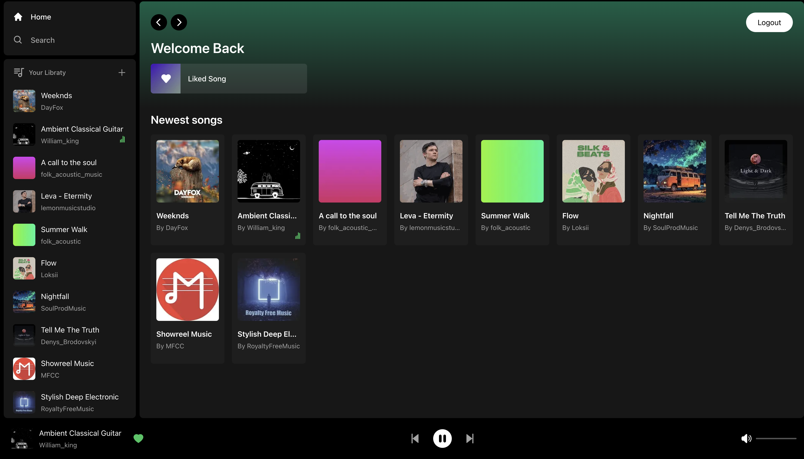
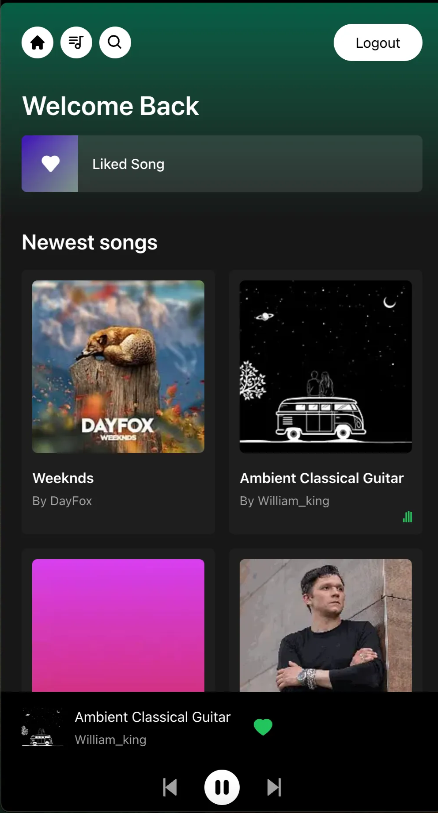

# Spotiflo

## Preview

 

[go online](https://spotiflo.vercel.app/)

## Description

[**Spotiflo**](https://spotiflo.vercel.app/) is an online mp3 player that allows:

- all users to play existing music on the platform.
- users with an account:
    - to create their own libraries .
    - to add music to the list of favourites.

## **Download and Installation**

To use the source code, choose one of the following options to get started:

- Clone the repo: `git clone https://github.com/Tandjune/spotiflo.git`
- [Fork, Clone, or Download on GitHub](https://github.com/Tandjune/spotiflo)

## Getting started

[**Spotiflo**](https://spotiflo.vercel.app/)  is a Next.js project. After cloning the project the following commands can be used:

- `npm run dev` to start Next.js in development mode.
- `npm run build` to build the application for production usage.
- `npm run start` to start a Next.js production server.
- `npm run lint` to set up Next.js' built-in ESLint configuration.

You must have npm installed globally on your machine in order to use these commands.